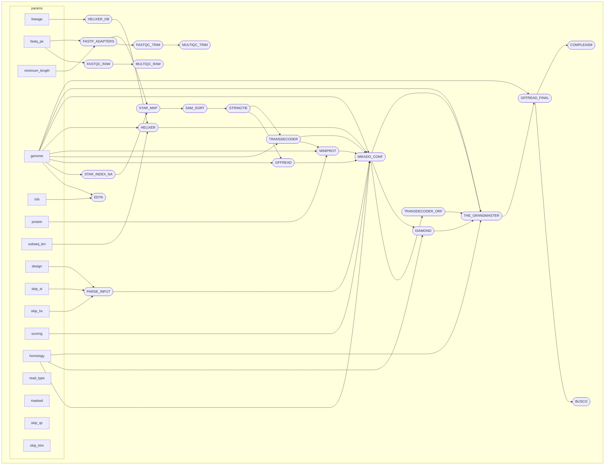

# Ragnarok

```
################################################################################
#                                   RAGNAROK!                                  #
#                         RApid Genome anNotAtion ROcKs!                       #
#                          Chris Gottschalk 12/6/2024                          #
#                                    v1.1                                      #
################################################################################
```

## quick start guide

### requirements

nextflow (22.10.4+)  
apptainer (1.1.8+)  
path to helixer model https://zenodo.org/records/10836346

### getting started

### running on a local server

First, do you have a working nextflow/apptainer version?

```
nextflow -version
apptainer --version
```

```
nextflow <path to your pipeline>/ragnarok/main.nf \
    --publish_dir <your desired results directory> \
    --genome <path to reference genome> \
    --skip_qc false \
    --skip_trim false \
    --skip_mark_dupe true \
    -profile local,four \
    -resume
```

Note the profile here is set up for use on a local server, but will likely require modification for your job. The `four` local profile is set up to use approximately 4 cpus maximum. Other presets exist in `conf/local.conf` and you can create your own by copying those examples.


### running on a slurm server

First, do you have a working nextflow/apptainer version?

```
nextflow -version
apptainer --version
```

Below is a sample sbatch script to run the pipeline. You'll need to replace the values with those that make sense for your use case.

```
#!/bin/bash
#SBATCH -J ragnarok
#SBATCH -A acf-utk0032
#SBATCH --partition=long
#SBATCH --qos=long
#SBATCH --nodes=1
#SBATCH --ntasks=2
#SBATCH --time=5-00:00:00
#SBATCH --error=job.e%J
#SBATCH --output=job.o%J

module load nextflow/23.10.0

export NXF_OPTS="-Xms500M -Xmx2G"
export NXF_ANSI_LOG=false

nextflow  <path to your pipeline>/vary_cool/main.nf \
    --publish_dir <your desired results directory> \
    --genome <path to reference genome> \
    --skip_qc false \
    --skip_trim false \
    -profile slurm,custom \
    -resume
```

Based on your qos/partition, you may want to modify the `conf/slurm.config` and `conf/slurm_custom.config` files to handle your dataset.

#### a few notes on slurm qos and partitions

This pipeline currently relies on four qos/partition configurations on the UTK ISAAC-NG system.

- short : maximum 3 hours, 12 jobs submitted
- campus : maximum 1 day, 94 jobs submitted
- long : maximum 6 days, 14 jobs submitted
- gpu : maximum 6 days, 14 jobs submitted

For each of the three labels found in `slurm.config` maxForks can be adjusted to qos that work on other sytems, and the imported clusterOptions for each can be updated with specific qos/partition/account information found in `slurm_custom.config`.

To check the limits for a given qos, replace short with any qos:

```
sacctmgr show qos where name=short
```

...or

```
scontrol show partition short
```

## development planning:

### desired input considerations

### necessary steps  
- [x] alignment 
  - [x] alignment - STAR
  - [ ] alignment - long reads
- [x] helixer
- [x] stringtie
- [x] gffread
- [x] miniprot
- [x] mikado2
- [x] busco
- [x] handle additional gff input paths
- [ ] determine steps where copying to publish_dir is needed

### optional steps  
- [x] QC
- [x] trimming
- [ ] FindPlantNLRs annotation
- [ ] EDTA masking
- [x] allow non land_plant model for Helixer (opened issue)

### obstacles
- [ ] mikado2 quay container is broken
- [ ] edta run fails on citrus genome

