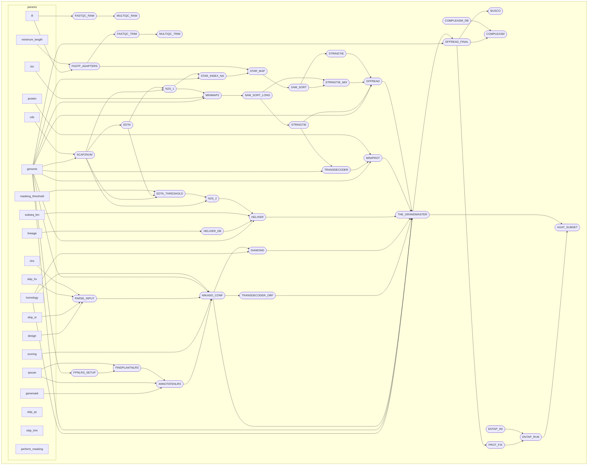

# Ragnarok!


```
################################################################################
#                                   RAGNAROK!                                  #
#                         RApid Genome anNotAtion ROcKs!                       #
################################################################################
```

Ragnarok is a nextflow-implemented pipeline for rapid genome annotation using multiple lines of evidence.

At its core, ragnarok performs alignments of RNA evidence in the form of illumina short reads, isoseq long reads, or a combination of the two. Protein alignments are then performed against likely coding sequences. Helixer-predicted genes are combined with all RNA and protein-based models (as well as any user-supplied existing annotations) and selectively filtered by Mikado for the best transcript models at overlapping loci.


## contents

- [requirements](#requirements)
  - [software prerequisites](#software-prerequisites)
  - [required files](#required-files)
  - [optional files](#optional-files)
  - [additional parameters](#additional-parameters)
- [getting started](#getting-started)
  - [running on a local server](#running-on-a-local-server)
  - [running on a slurm server](#running-on-a-slurm-server)
  - [a few notes on slurm qos and partitions](#a-few-notes-on-slurm-qos-and-partitions)
- [output files](#output-files)
  - [output overview](#output-overview)
  - [detailed output example](#detailed-output-example)
- [experimental features](#getting-started)
  - [EDTA masking](#EDTA-masking)
  - [plant NLR annotation](#plant-NLR-annotation)
- [tools used in ragnarok](#tools-used-in-ragnarok)
  - [tool images](#tool-images)
- [license](#license)

# requirements

## software prerequisites
**nextflow** (22.10.4+)  
**apptainer** (1.1.8+)

Ragnarok is built for LINUX-based systems and relies on **Nextflow** and **Apptainer** (FKA Singularity). Both must be installed and available in your working environment prior to use.

Nextflow installation routes:
- [Nextflow quick install guide](https://www.nextflow.io/docs/latest/getstarted.html) (requires Java)
- [Nextflow conda image](https://anaconda.org/bioconda/nextflow) (requires Anaconda)

Assuming your machine is set up with the appropriate prerequisite Java version and you have permissions to do so, installing nextflow can be accomplished as follows:

```bash
mkdir -p ~/bin && cd ~/bin # optional location for binary
curl -s https://get.nextflow.io | bash
chmod +x nextflow
```

Apptainer installation routes:
- [Apptainer quick install](https://apptainer.org/docs/user/latest/quick_start.html#quick-installation)
- [Apptainer binary](https://apptainer.org/docs/admin/1.2/installation.html) See "Install unprivileged from pre-built binaries".
- we recommend against using the conda package for singularity (v3.8.7) as it is quite dated and has been found to have unintended behaviors.

A possible route to installing the `unprivileged` version of Apptainer might go something like this on your system:

```bash
mkdir -p ~/bin && cd ~/bin # optional location for binary
curl -s https://raw.githubusercontent.com/apptainer/apptainer/main/tools/install-unprivileged.sh | bash -s - ~/
```

Add the following to your `.bashrc`, then run `source ~/.bashrc` to allow executables for nextflow and apptainer to be used anywhere on your system:

```bash
export PATH="$HOME/bin:$PATH"
```

Ragnarok is publicly available through [its github page](https://github.com/ryandkuster/ragnarok).

Ragnarok can be cloned anywhere you'd like.

```bash
mkdir -p ~/nextflow && cd ~/nextflow # optional location, matches examples below
git clone https://github.com/ryandkuster/ragnarok
```

## required files

|parameter|type|description|
|:-|:-|:-|
|`--genome`|.fna|Provide your assembly (ideally with *simple* names if using EDTA masking option).|
|`--ill`|string|Required if `iso` not used. Path to a directory containing paired end fastq files. Can end with directory name (Ex: path/to/files/) or a specific prefix of the paired files (Ex: path/to/files/reads_P1). Using specific prefix name will search for the paired end read files ending in R1.[fq|fastq].gz .|
|`--iso`|string|Required if `ill` not used. Path to a directory containing long read fastq files. Can end with directory name (Ex: path/to/files/) or a specific prefix of the paired files (Ex: path/to/files/reads_P1). Using specific prefix name will search for the paired end read files ending in [fq|fastq].gz .|
|`--protein`|.faa|Protein file for miniprot (e.g., closest ref species).|
|`--homology`|.faa|Mikado protein homology file (e.g., [uniprot 33090 for viridiplantae](https://www.uniprot.org/uniprotkb?query=viridiplantae&facets=reviewed%3Atrue)).|
|`--scoring`|.yaml|Mikado scoring file (e.g., [plant.yaml](https://github.com/EI-CoreBioinformatics/mikado/tree/master/Mikado/configuration/scoring_files)).|
|`--design`|.tsv|Mikado configuration table file (see Mikado [documentation](https://mikado.readthedocs.io/en/stable/Tutorial/) and below).|

The mikado2 stage of the pipeline requires a configuration table to weigh the input gene models and give model priority. For this `--design` input, Ragnarok has the mandatory fields (`hx`, `st`, `mp`, `tr`) for the helixer, stringtie, miniprot, and transdecoder models produced along the way. Users should leave the file field blank if they are to be performed in the pipeline, but all other fields should be present. 

The fields in this file are `file location`, `alias`, `strand-specific`, `sample-score`, `reference`, and `exclude redundant models`. Mikado [documentation](https://mikado.readthedocs.io/en/stable/Tutorial/) provides further information on the choice of values in this table.

Example tsv configuration (assets/mikado_conf.tsv):

```
	hx	True		False	False
	st	True	1	False	True
	tr	False	-0.5	False	False
	mp	True	1	False	False
```

> [!NOTE]
> _The first field is intentionally missing as Ragnarok will produce these outputs._

Ragnarok also allows for any number of *existing* input annotations (gff3) to be input as additional models into the mikado2 stage of processing.

Hypothetical tsv configuration including combination of Ragnarok (empty file fields) and existing models:

```
	hx	True		False	False
	st	True	1	False	True
	tr	False	-0.5	False	False
	mp	True	1	False	False
cufflinks.gtf	cuff	True		False	False
trinity.gff3	tr	False	-0.5	False	False
reference.gff3	at	True	5	True	False
```

> [!NOTE]
> _The filepath to existing gffs will need to be provided._

## optional files

|parameter|type|description|
|:-|:-|:-|
|`--lo_genome`|.fna|Reference genome to use for liftover, requires corresponding `--lo_gff`|
|`--lo_gff`|.gff|Reference annotations to use for liftover, requires corresponding `--lo_genome`|

## additional parameters

|parameter|type|description|default|
|:-|:-|:-|:-|
|`--lineage`|url|URL path to helixer model https://zenodo.org/records/10836346.|"https://zenodo.org/records/10836346/files/land_plant_v0.3_a_0080.h5"|
|`--subseq_len`|int|Helixer subseq length.|64152|
|`--skip_qc`|bool|Perform fastqc/multiqc on raw read data.|true|
|`--skip_trim`|bool|Perform adapter trimming on raw read data|true|
|`--minimum_length`|int|Use with `--skip_trim`, minimum length read to keep when adapter trimming.|50|
|`--skip_st`|bool|Requires st, tr, mp gff files locally (in `--design` file), bypass Stringtie steps.|false|
|`--skip_hx`|bool|Requires hx file locally (in `--design` file), bypass Helixer step.|false|
|`--contam`|comma-sep list|Entap list of taxa to consider as contaminants.|"insecta,fungi,bacteria"|
|`--busco_db`|str|Desired BUSCO dataset from BUSCO v5.8.1 and above.|"embryophyta_odb12"|
|`--final_prefix`|str|File prefix for final files in RAGNAROK publish directory|"ragnarok"|
|`--max_intron`|int|Maximum intron length used for STAR alignIntronMax.|10000|

# getting started

## running on a local server

First, do you have a working nextflow/apptainer version?

```
nextflow -version
apptainer --version
```

Set a scratch directory for singularity.
```
SCRATCHDIR= <path>
```

Below is a sample script to run the pipeline. You'll need to replace the `<>` values with those that make sense for your use case.

```
nextflow run ~/nextflow/ragnarok/main.nf \
    --publish_dir     < path to results location > \
    --genome          < path to genome in fasta > \
    --cds             < path to cds fasta file > \
    --protein         < path to protein (aa) fasta file > \
    --ill             < path to directory that immediately contains all R1/R2 fastqs > \
    --iso             < path to directory that immediately contains all long read fastqs > \
    --perform_masking < bool > \
    --skip_qc         < bool > \
    --skip_trim       < bool > \
    --nlrs            < bool > \
    --ipscan          < path to interproscan directory > \
    --genemark        < path to prepared genemark directory (see `optional files` section) > \
    --design          < tsv file with expected gff files and weights for mikado > \
    --scoring         < path to mikado scoring file (e.g., plant.yaml) > \
    --homology        < path to homology fasta file (e.g., uniprot for you phylum )> \
    -profile local,four \
    -resume
```

Note the profile here is set up for use on a local server, but will likely require modification for your job. The `four` local profile is set up to use approximately 4 cpus maximum. Other presets exist in `conf/local.conf` and you can create your own by copying those examples.


## running on a slurm server

First, do you have a working nextflow/apptainer version?

```
nextflow -version
apptainer --version
```

Below is a sample sbatch script to run the pipeline. You'll need to replace the `<>` values with those that make sense for your use case.

```
#!/bin/bash
#SBATCH -J ragnarok
#SBATCH -A acf-utk0032
#SBATCH --partition=long
#SBATCH --qos=long
#SBATCH --nodes=1
#SBATCH --ntasks=2
#SBATCH --time=5-00:00:00
#SBATCH --error=job.e%J
#SBATCH --output=job.o%J

SCRATCHDIR=< path to a directory to store singularity cache >

export NXF_OPTS="-Xms500M -Xmx2G"
export NXF_ANSI_LOG=false
SCRATCHDIR= <path to scratch for singularity>

nextflow run ~/nextflow/ragnarok/main.nf \
    --publish_dir     < path to results location > \
    --genome          < path to genome in fasta > \
    --cds             < path to cds fasta file > \
    --protein         < path to protein (aa) fasta file > \
    --ill             < path to directory that immediately contains all R1/R2 fastqs > \
    --iso             < path to directory that immediately contains all long read fastqs > \
    --perform_masking < bool > \
    --skip_qc         < bool > \
    --skip_trim       < bool > \
    --nlrs            < bool > \
    --ipscan          < path to interproscan directory > \
    --genemark        < path to prepared genemark directory (see `optional files` section) > \
    --design          < tsv file with expected gff files and weights for mikado > \
    --scoring         < path to mikado scoring file (e.g., plant.yaml) > \
    --homology        < path to homology fasta file (e.g., uniprot for you phylum )> \
    -profile slurm,custom \
    -resume
```

Based on your qos/partition, you may want to modify the `conf/slurm.config` and `conf/slurm_custom.config` files to handle your dataset.

### a few notes on slurm qos and partitions

This pipeline currently relies on four qos/partition configurations on the UTK ISAAC-NG system.

- short : maximum 3 hours, 12 jobs submitted
- campus : maximum 1 day, 94 jobs submitted
- long : maximum 6 days, 14 jobs submitted
- gpu : maximum 4 hours, 1 job submitted

For each of the three labels found in `slurm.config` maxForks can be adjusted to qos that work on other sytems, and the imported clusterOptions for each can be updated with specific qos/partition/account information found in `slurm_custom.config`.

To check the limits for a given qos, replace short with any qos:

```
sacctmgr show qos where name=short
```

...or

```
scontrol show partition short
```

# output files

## output overview

Upon completion of the pipeline, the defined publish directory (`--publish_dir`) will contain the following subdirectories:

```
publish
├── RAGNAROK           (final output files and associated sequences/summaries)
├── alignments
│   ├── sorted_bam
│   └── star
├── design             (relevant metadata from user input)
├── entap
│   └── entap_outfiles (EnTAP output directory with functional annotations)
├── mikado
│   ├── mikado_in      (gff files and configuration/scoring used as input)
│   └── mikado_out     (the raw output of mikado)
└── summary            (nextflow reports on run)
```

## detailed output example

```
publish
├── RAGNAROK/
│   ├── ragnarok.entap_filtered.busco_embryophyta_odb12.txt
│   ├── ragnarok.entap_filtered.compleasm_embryophyta_odb12.txt
│   ├── ragnarok.entap_filtered.gff3
│   ├── ragnarok.entap_filtered.proteins.faa
│   ├── ragnarok.entap_filtered.transcripts.fna
│   └── ragnarok.entap_no_annotation.gff3
├── alignments/
│   ├── sorted_bam/
│   │   └── short_sorted_merged.bam
│   └── star/
│       ├── CB_N_B_T1Aligned.out.bam -> <symlink>
│       ├── CB_N_B_T1Log.final.out -> <symlink>
│       ├── CB_N_B_T1Log.out -> <symlink>
│       ├── CB_N_B_T1Log.progress.out -> <symlink>
│       └── star_CB_N_B_T1.out -> <symlink>
├── design/
│   ├── gff_paths.csv
│   └── mikado.tsv
├── entap/
│   └── entap_outfiles/
│       └── final_results/
├── mikado/
│   ├── mikado_in/
│   │   ├── configuration.yaml
│   │   ├── genome_unzip.fna.fai
│   │   ├── mikado_prepared.fasta
│   │   ├── mikado_prepared.gtf
│   │   ├── pre_mikado_10kIntron_stringtie.gff
│   │   ├── pre_mikado_aa_miniprot.gff
│   │   ├── pre_mikado_helixer.gff3
│   │   └── pre_mikado_transcripts.fasta.transdecoder.genome.gff3
│   └── mikado_out/
│       ├── mikado.loci_out.gff3
│       └── mikado.subloci.gff3
└── summary/
    ├── 2025-08-14_15-15_dag.html
    ├── 2025-08-14_15-15_report.html
    ├── 2025-08-14_15-15_timeline.html
    └── 2025-08-14_15-15_trace.html
```

# experimental features

The following features are under development and work on many (but not all) systems.

## EDTA masking

|parameter|type|description|
|:-|:-|:-|
|`--perform_masking`|bool|Run EDTA to mask input genome (recommended).|false|
|`--masking_threshold`|int|Use with `perform_masking` to custom hard-mask TEanno models >= this length.|EDTA default is 1000bp|
|`--cds`|.fna|CDS file for your species for use with `--perform_masking true` (used by EDTA)|


> [!NOTE]
> _If EDTA does not work well with your server, consider running the [conda version](https://github.com/oushujun/EDTA?tab=readme-ov-file#install-with-condamamba-linux64) standalone and input the hard-masked genome as the --genome parameter before running Ragnarok._

## plant NLR annotation

|parameter|type|description|
|:-|:-|:-|
|`--nlrs`|bool|Run FindPlantNLRs.|false|
|`--ipscan`|directory|Locally stored interproscan for use with `--nlrs true` ([64-bit download](https://www.ebi.ac.uk/interpro/download/InterProScan/))|
|`--genemark`|directory|Genemark with key configured for use with `--nlrs true` (see assets/genemark_setup.sh)|

> [!NOTE]
> _Using FindPlantNLRs with a pre-masked genome is not recommended._

Example tsv configuration for `--nlrs true` (assets/mikado_nlr_conf.tsv):

```
	hx	True		False	False
	st	True	1	False	True
	tr	False	-0.5	False	False
	mp	True	1	False	False
	nlr	True	1	False	False
```



# tools used in ragnarok

- [AGAT](https://agat.readthedocs.io/en/latest/)
- [bedtools](https://bedtools.readthedocs.io/en/latest/)
- [BUSCO](https://busco.ezlab.org)
- [compleasm](https://github.com/huangnengCSU/compleasm)
- [diamond](https://github.com/bbuchfink/diamond)
- [EDTA](https://github.com/oushujun/EDTA)
- [EnTAP2](https://entap.readthedocs.io/en/latest/index.html)
- [fastp](https://github.com/OpenGene/fastp)
- [fastqc](https://www.bioinformatics.babraham.ac.uk/projects/fastqc/)
- [FindPlantNLRs](https://github.com/ZhenyanLuo/FindPlantNLRs/tree/docker_version)
- [gffread](https://github.com/gpertea/gffread)
- [Helixer](https://github.com/weberlab-hhu/Helixer)
- [Liftoff](https://github.com/agshumate/Liftoff)
- [Mikado](https://mikado.readthedocs.io/en/stable/)
- [minimap2](https://github.com/lh3/minimap2)
- [miniprot](https://github.com/lh3/miniprot)
- [multiqc](https://github.com/MultiQC/MultiQC)
- [pandas](https://pandas.pydata.org)
- [samtools](https://www.htslib.org)
- [STAR](https://github.com/alexdobin/STAR)
- [StringTie](https://ccb.jhu.edu/software/stringtie/index.shtml)
- [TransDecoder](https://github.com/TransDecoder/TransDecoder)

## tool images

- agat:quay.io/biocontainers/agat:1.4.2--pl5321hdfd78af_0
- bedtools:quay.io/biocontainers/bedtools:2.31.1--h13024bc_3
- busco:quay.io/biocontainers/busco:5.8.2--pyhdfd78af_0
- compleasm:quay.io/biocontainers/compleasm:0.2.7--pyh7e72e81_0
- diamond:quay.io/biocontainers/diamond:2.1.11--h5ca1c30_1
- edta:quay.io/biocontainers/edta:2.2.2--hdfd78af_1
- entap:docker://plantgenomics/entap:2.2.0
- fastp:quay.io/biocontainers/fastp:0.23.4--h125f33a_5
- fastqc:quay.io/biocontainers/fastqc:0.12.1--hdfd78af_0
- findplantnlrs:docker://ryandk/findplantnlrs:latest
- gffread:quay.io/biocontainers/gffread:0.12.7--h077b44d_6
- helixer:docker://gglyptodon/helixer-docker:helixer_v0.3.4_cuda_12.2.2-cudnn8
- liftoff:docker://quay.io/biocontainers/liftoff:1.6.3--pyhdfd78af_1
- mikado2:docker://gemygk/mikado:v2.3.5rc2
- minimap2:quay.io/biocontainers/minimap2:2.28--h577a1d6_4
- miniprot:quay.io/biocontainers/miniprot:0.13--h577a1d6_2
- multiqc:quay.io/biocontainers/multiqc:1.24.1--pyhdfd78af_0
- pandas:quay.io/biocontainers/pandas:1.5.2
- samtools:quay.io/biocontainers/samtools:1.20--h50ea8bc_1
- star:quay.io/biocontainers/star:2.7.11a--h0033a41_0
- stringtie:quay.io/biocontainers/stringtie:3.0.0--h29c0135_0
- transdecoder:quay.io/biocontainers/transdecoder:5.7.1--pl5321hdfd78af_0

See conf/containers.config for most current versions.

# license

<a href="https://github.com/ryandkuster/ragnarok/blob/master/LICENSE">MIT license</a>
